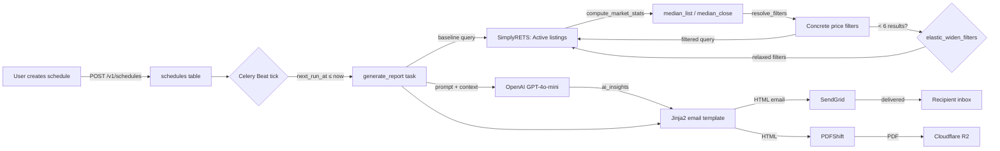

# TrendyReports — Site Architecture Tree

> Repo directory tree, logical component tree, and data-flow overview.
> Each node links to its relevant module doc.

---

## 1. Repository Directory Tree (Abridged)

```
reportscompany/
├── apps/
│   ├── api/                        # FastAPI backend
│   │   └── src/api/
│   │       ├── main.py             # App init, router mounts
│   │       ├── settings.py         # Env config (Pydantic)
│   │       ├── db.py               # PostgreSQL connection + RLS helpers
│   │       ├── auth.py             # JWT sign/verify, password hashing
│   │       ├── worker_client.py    # Celery task enqueueing
│   │       ├── config/
│   │       │   └── billing.py      # Stripe price ID mapping
│   │       ├── deps/
│   │       │   └── admin.py        # require_platform_admin dependency
│   │       ├── schemas/
│   │       │   └── property.py     # PropertyData, ComparableData models
│   │       ├── middleware/
│   │       │   ├── authn.py        # AuthContextMiddleware, RateLimitMiddleware
│   │       │   └── rls.py          # RLSContextMiddleware
│   │       ├── routes/             # 26 route modules
│   │       │   ├── auth.py
│   │       │   ├── property.py     # ← comparables fallback ladder [NEW]
│   │       │   ├── reports.py
│   │       │   ├── schedules.py
│   │       │   ├── billing.py
│   │       │   ├── stripe_webhook.py
│   │       │   ├── admin.py
│   │       │   ├── admin_metrics.py  # ← platform analytics [NEW]
│   │       │   ├── me.py
│   │       │   ├── users.py
│   │       │   ├── affiliates.py
│   │       │   ├── contacts.py
│   │       │   ├── contact_groups.py
│   │       │   ├── leads.py
│   │       │   ├── lead_pages.py
│   │       │   ├── mobile_reports.py
│   │       │   ├── health.py
│   │       │   └── ... (9 more)
│   │       └── services/           # 15+ business logic modules
│   │           ├── simplyrets.py   # ← API-layer SimplyRETS client [NEW]
│   │           ├── sitex.py        # ← SiteX Pro client [NEW]
│   │           ├── usage.py
│   │           ├── plans.py
│   │           ├── affiliates.py
│   │           ├── accounts.py
│   │           ├── email.py
│   │           ├── branding.py
│   │           ├── property_stats.py
│   │           ├── qr_service.py
│   │           ├── twilio_sms.py
│   │           ├── upload.py
│   │           ├── agent_code.py
│   │           ├── billing_state.py
│   │           └── plan_lookup.py
│   │
│   ├── web/                        # Next.js 16 frontend (Vercel)
│   │   ├── app/
│   │   │   ├── (public pages)/     # /, /login, /register, /about, etc.
│   │   │   ├── p/[code]/           # Lead capture pages
│   │   │   ├── cma/[code]/         # Consumer CMA viewer
│   │   │   ├── r/[id]/             # Mobile report viewer
│   │   │   ├── print/[runId]/      # Print-optimized report
│   │   │   ├── social/[runId]/     # Social share view
│   │   │   ├── app/                # Protected routes (auth required)
│   │   │   │   ├── layout.tsx      # App shell (sidebar, nav)
│   │   │   │   ├── reports/        # Market report wizard + list
│   │   │   │   ├── property/       # Property report wizard + list
│   │   │   │   ├── schedules/      # Schedule wizard + list
│   │   │   │   ├── people/         # Contacts
│   │   │   │   ├── leads/          # Lead management
│   │   │   │   ├── lead-page/      # Lead page editor
│   │   │   │   ├── billing/        # Stripe billing
│   │   │   │   ├── branding/       # White-label editor
│   │   │   │   ├── account/        # Account settings
│   │   │   │   ├── affiliate/      # Affiliate dashboard
│   │   │   │   └── admin/          # Platform admin console
│   │   │   └── api/proxy/          # ~60 proxy routes to FastAPI
│   │   ├── components/
│   │   │   ├── ui/                 # 75 Radix/shadcn primitives
│   │   │   ├── property/           # Property search, comps picker
│   │   │   ├── property-wizard/    # Property report wizard steps
│   │   │   ├── report-builder/     # Market report wizard
│   │   │   ├── schedule-builder/   # Schedule wizard
│   │   │   ├── schedules/          # Schedule management
│   │   │   ├── admin/              # Admin dashboard
│   │   │   ├── marketing/          # Landing page sections
│   │   │   ├── onboarding/         # Onboarding wizard
│   │   │   └── branding/           # Branding preview/editor
│   │   └── lib/
│   │       ├── api.ts              # Client-side fetch (via proxy)
│   │       ├── api-server.ts       # Server-side fetch (direct)
│   │       └── hooks/              # React Query hooks
│   │
│   └── worker/                     # Celery worker (Render)
│       └── src/worker/
│           ├── app.py              # Celery init + beat schedule
│           ├── tasks.py            # generate_report, generate_property_report_task
│           ├── schedules_tick.py   # Every-minute schedule executor
│           ├── property_builder.py # ← HTML report renderer (5 themes) [NEW]
│           ├── filter_resolver.py  # ← Market-adaptive filters [NEW]
│           ├── ai_insights.py      # GPT-4o-mini commentary
│           ├── pdf_engine.py       # PDF generation coordinator
│           ├── pdf_adapter.py      # PDFShift API integration
│           ├── limit_checker.py    # Worker-context plan limits
│           ├── cache.py            # Redis caching layer
│           ├── query_builders.py   # SQL query builders
│           ├── social_engine.py    # Social image generation
│           ├── schedules_tick.py   # Periodic schedule trigger
│           ├── vendors/
│           │   └── simplyrets.py   # ← Worker SimplyRETS client [NEW]
│           ├── compute/
│           │   ├── calc.py         # Statistical calculations
│           │   ├── extract.py      # Data extraction
│           │   └── validate.py     # Data validation
│           ├── email/
│           │   ├── send.py         # Email dispatch
│           │   └── template.py     # Email template rendering
│           └── templates/
│               └── property/       # 5 theme × 2 Jinja2 templates each
│                   ├── classic/
│                   ├── modern/
│                   ├── elegant/
│                   ├── teal/
│                   └── bold/
│
├── packages/
│   └── ui/                         # Shared React component library
│       └── src/components/         # 60+ components
│
├── libs/
│   └── shared/                     # Shared Python utilities
│       └── src/shared/
│           └── email/              # Email template utilities
│
├── db/
│   └── migrations/                 # 42 SQL migration files
│
├── docs/
│   └── architecture/               # ← This documentation
│       ├── SOURCE_OF_TRUTH.md      # System overview (this doc's parent)
│       ├── INDEX.md                # Quick-reference source tree
│       ├── WIZARD_AND_API_CALLS.md # Wizard flows + API reference
│       ├── SITE_ARCHITECTURE_TREE.md  # (this file)
│       ├── ARCHITECTURE_AUDIT.md   # Docs audit report
│       ├── backend-core.md
│       ├── backend-middleware.md
│       ├── backend-routes.md
│       ├── backend-services.md
│       ├── frontend-core.md
│       ├── frontend-pages.md
│       ├── frontend-components.md
│       ├── frontend-api-proxy.md
│       ├── property-type-data-contract.md
│       ├── performance-audit.md
│       └── modules/                # Detailed module docs [NEW]
│           ├── simplyrets-api-service.md
│           ├── sitex-api-service.md
│           ├── property-routes-comparables.md
│           ├── worker-simplyrets-vendor.md
│           ├── worker-tasks.md
│           ├── property-builder.md
│           ├── filter-resolver.md
│           ├── worker-core.md
│           ├── admin-metrics-routes.md
│           ├── cli-tools.md
│           └── test-suite.md
│
├── tests/
│   └── test_property_templates.py  # pytest: 5 themes × 6 test classes
│
├── e2e/
│   ├── auth.spec.ts                # Playwright: auth flows
│   ├── affiliate.spec.ts           # Playwright: affiliate flows
│   ├── plan.spec.ts                # Playwright: plan management
│   └── stripe.spec.ts              # Playwright: Stripe webhooks
│
├── scripts/                        # Dev/QA scripts (not production)
│   ├── test_simplyrets.py
│   ├── test_sitex.py
│   ├── test_property_report_flow.py
│   ├── test_all_reports.py
│   ├── generate_all_property_pdfs.py
│   ├── generate_theme_previews.py
│   └── ... (20+ more)
│
├── qa_deliver_reports.py           # ← QA delivery automation [NEW]
├── pytest.ini
├── playwright.config.ts
├── pnpm-workspace.yaml
└── docker-compose.yml
```

---

## 2. Logical Component Tree

```
┌─────────────────────────────────────────────────────────────────┐
│  EXTERNAL                                                        │
│  ┌──────────┐  ┌────────────┐  ┌──────────┐  ┌──────────────┐  │
│  │ SiteX Pro│  │ SimplyRETS │  │ SendGrid │  │ PDFShift API │  │
│  └────┬─────┘  └─────┬──────┘  └────┬─────┘  └──────┬───────┘  │
└───────┼──────────────┼──────────────┼────────────────┼──────────┘
        │              │              │                │
┌───────▼──────────────▼──────────────▼────────────────▼──────────┐
│  FastAPI BACKEND (apps/api)                                       │
│                                                                   │
│  Middleware: AuthContext → RateLimiter → RLSContext               │
│                                                                   │
│  Routes:                                                          │
│  ┌─────────────────┐  ┌──────────────────┐  ┌─────────────────┐ │
│  │ property.py     │  │ reports.py       │  │ schedules.py    │ │
│  │ [SiteX + Comps  │  │ [Market report   │  │ [Schedule CRUD] │ │
│  │  Fallback L0-L5]│  │  CRUD + enqueue] │  │                 │ │
│  └────────┬────────┘  └────────┬─────────┘  └────────┬────────┘ │
│           │                    │                      │           │
│  Services:│                    │                      │           │
│  ┌────────▼──────┐  ┌──────────▼─────────┐           │           │
│  │ sitex.py      │  │ simplyrets.py      │           │           │
│  │ [Subject prop]│  │ [API-layer MLS]    │           │           │
│  └───────────────┘  └────────────────────┘           │           │
│                                                       │           │
│  ┌──────────────────────────────────────────────────  ▼  ──────┐ │
│  │ worker_client.py → enqueue Celery tasks                      │ │
│  └──────────────────────────────────────────────────────────────┘ │
└───────────────────────────────────────────────────────────────────┘
                             │
        ┌────────────────────▼────────────────────┐
        │  Redis (Celery broker + result backend)  │
        └────────────────────┬────────────────────┘
                             │
┌────────────────────────────▼────────────────────────────────────┐
│  Celery WORKER (apps/worker)                                     │
│                                                                  │
│  Beat: schedules_tick → fires due schedules every minute        │
│                                                                  │
│  Tasks:                                                          │
│  ┌───────────────────────────────────────────────────────────┐  │
│  │ generate_report (market reports)                          │  │
│  │  ├── vendors/simplyrets.py [paginated, rate-limited]      │  │
│  │  ├── filter_resolver.py [market-adaptive + elastic widen] │  │
│  │  ├── ai_insights.py [GPT-4o-mini]                         │  │
│  │  ├── email/template.py [Jinja2 render]                    │  │
│  │  ├── pdf_adapter.py [PDFShift]                            │  │
│  │  └── email/send.py [SendGrid]                             │  │
│  └───────────────────────────────────────────────────────────┘  │
│  ┌───────────────────────────────────────────────────────────┐  │
│  │ generate_property_report_task (property reports)          │  │
│  │  ├── property_builder.py [Jinja2, 5 themes, 7 pages]      │  │
│  │  ├── pdf_adapter.py [PDFShift]                            │  │
│  │  └── R2 upload [Cloudflare]                               │  │
│  └───────────────────────────────────────────────────────────┘  │
└──────────────────────────────────────────────────────────────────┘
                             │
┌────────────────────────────▼────────────────────────────────────┐
│  OUTPUTS                                                         │
│  ┌────────────────┐  ┌────────────────┐  ┌────────────────────┐ │
│  │ PDF (R2 URL)   │  │ Email (inbox)  │  │ Webhook payload    │ │
│  └────────────────┘  └────────────────┘  └────────────────────┘ │
└──────────────────────────────────────────────────────────────────┘
```

---

## 3. Data Flow — Property Report

```mermaid
flowchart LR
    A[User enters address] -->|POST /v1/property/search| B[SiteX Pro API]
    B -->|PropertyData + UseCode| C[Frontend: Step 1 complete]
    C -->|POST /v1/property/comparables| D{Fallback Ladder}
    D -->|L0: strict| E[SimplyRETS]
    D -->|L1-L5: relaxed| E
    E -->|listings| F[Post-filter by property_type]
    F -->|comparables + confidence| G[Frontend: Step 2]
    G -->|User curates comps| H[POST /v1/property/reports]
    H -->|report_id| I[POST /generate]
    I -->|Celery task| J[PropertyReportBuilder]
    J -->|HTML| K[PDFShift]
    K -->|PDF| L[Cloudflare R2]
    L -->|pdf_url| M[Agent downloads PDF]
```



---

## 4. Data Flow — Market Report (Schedule)



---

## 5. Component → Module Doc Links

| Component | Module Doc |
|-----------|-----------|
| `apps/api/src/api/services/simplyrets.py` | [simplyrets-api-service.md](./modules/simplyrets-api-service.md) |
| `apps/api/src/api/services/sitex.py` | [sitex-api-service.md](./modules/sitex-api-service.md) |
| `apps/api/src/api/routes/property.py` | [property-routes-comparables.md](./modules/property-routes-comparables.md) |
| `apps/worker/src/worker/vendors/simplyrets.py` | [worker-simplyrets-vendor.md](./modules/worker-simplyrets-vendor.md) |
| `apps/worker/src/worker/tasks.py` | [worker-tasks.md](./modules/worker-tasks.md) |
| `apps/worker/src/worker/property_builder.py` | [property-builder.md](./modules/property-builder.md) |
| `apps/worker/src/worker/filter_resolver.py` | [filter-resolver.md](./modules/filter-resolver.md) |
| `apps/worker/src/worker/app.py` + `schedules_tick.py` + `cache.py` | [worker-core.md](./modules/worker-core.md) |
| `apps/api/src/api/routes/admin_metrics.py` | [admin-metrics-routes.md](./modules/admin-metrics-routes.md) |
| `qa_deliver_reports.py`, `scripts/test_*.py` | [cli-tools.md](./modules/cli-tools.md) |
| `tests/`, `e2e/` | [test-suite.md](./modules/test-suite.md) |
| Backend core (`main.py`, `db.py`, `auth.py`, `settings.py`) | [backend-core.md](./backend-core.md) |
| Middleware (`authn.py`, `rls.py`) | [backend-middleware.md](./backend-middleware.md) |
| All 26 route modules | [backend-routes.md](./backend-routes.md) |
| All 15 service modules | [backend-services.md](./backend-services.md) |
| Next.js pages | [frontend-pages.md](./frontend-pages.md) |
| React components | [frontend-components.md](./frontend-components.md) |
| API proxy routes | [frontend-api-proxy.md](./frontend-api-proxy.md) |
| Property type mapping | [property-type-data-contract.md](./property-type-data-contract.md) |
