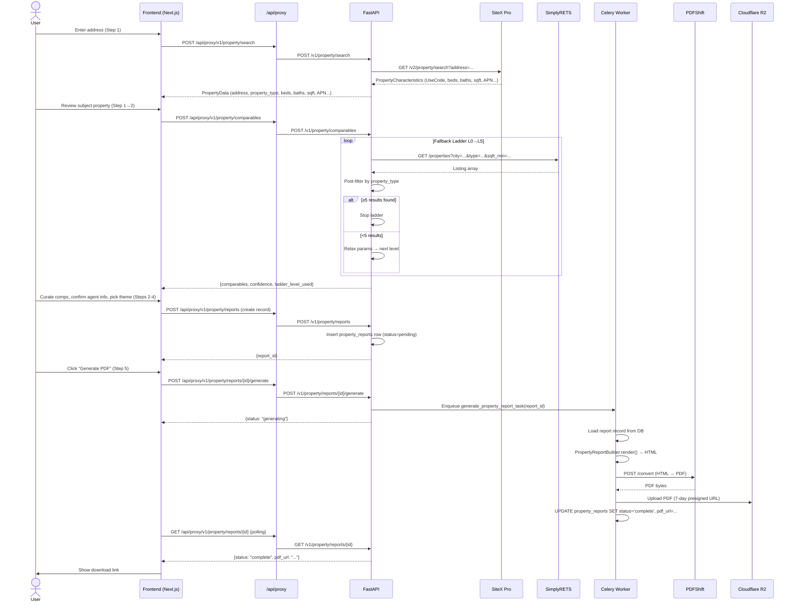
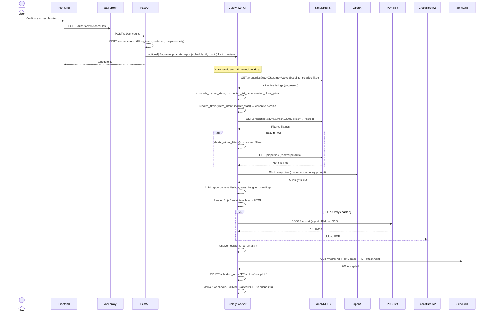

# TrendyReports: Wizard Flows & External API Calls

> Authoritative reference for the Property Report wizard, the Market Report (Schedule) wizard, all external API calls, the comparables fallback ladder, and caching rules.

---

## 1. Property Report Wizard

### Steps Overview

| Step | UI Component | What Happens |
|------|-------------|---------------|
| 1 | Address Search | User enters address → SiteX lookup → subject property loaded |
| 2 | Comparable Selection | System fetches comps (fallback ladder) → user curates list |
| 3 | Agent Info | User confirms/edits agent name, license, phone, email, headshot |
| 4 | Theme & Pages | User selects visual theme (5 options) and pages to include |
| 5 | Generate | PDF generation enqueued; user polls for completion |

### Property Report Flow (Sequence Diagram)



---

## 2. Market Report (Schedule) Wizard

### Steps Overview

| Step | UI Component | What Happens |
|------|-------------|---------------|
| 1 | Report Type | Select from 8 report types |
| 2 | Area | Enter city name (free text) |
| 3 | Audience | Select preset or custom filters |
| 4 | Recipients | Select contacts, groups, or enter emails |
| 5 | Cadence | Weekly / biweekly / monthly |
| 6 | Review | Preview settings, confirm |
| 7 | Deliver | Save schedule; optionally trigger immediate delivery |

### Market Report Generation Flow (Sequence Diagram)



---

## 3. External API Calls Reference

### 3.1 SiteX Pro API

**Base URL:** `https://api.sitexpro.com`

#### Authentication

| Type | Details |
|------|---------|
| Flow | OAuth2 Client Credentials |
| Token endpoint | `POST /oauth/token` |
| Token TTL | 10 minutes (refreshed at 9 min) |
| Header | `Authorization: Bearer <token>` |

#### Endpoint: Property Search by Address

```
GET /v2/property/search
```

| Parameter | Required | Type | Notes |
|-----------|----------|------|-------|
| `address` | ✅ | `string` | Full street address |
| `city` | ✅ | `string` | City name |
| `state` | ✅ | `string` | 2-letter state code |
| `zip` | ✅ | `string` | ZIP code |

**Response fields used:**

| Field path | Maps to | Notes |
|-----------|---------|-------|
| `PropertyCharacteristics.UseCode` | `property_type` | Drives SimplyRETS type mapping |
| `PropertyCharacteristics.LivingArea` | `sqft` | |
| `PropertyCharacteristics.Bedrooms` | `beds` | |
| `PropertyCharacteristics.TotalBaths` | `baths` | |
| `PropertyCharacteristics.YearBuilt` | `year_built` | |
| `PropertyCharacteristics.LotSize` | `lot_size` | |
| `PropertyCharacteristics.LegalDescription` | `legal_description` | |
| `OwnerInformation.OwnerName` | `owner_name` | |
| `AssessmentTaxInfo.TotalAssessedValue` | `assessed_value` | |
| `PropertyCharacteristics.FIPSCode` | `fips` | For APN-based re-lookup |
| `PropertyCharacteristics.APN` | `apn` | |

**Possible errors:**

| Status | Meaning | Handling |
|--------|---------|---------|
| 200, multiple results | Multiple properties matched | Raise `MultiMatchError` → prompt user for APN |
| 404 | No results | Return `None` → UI shows "not found" |
| 401 | Token expired/invalid | Auto-refresh token, retry once |
| 503 | SiteX down | `HTTP 503` to client |

#### Endpoint: Property Search by APN

```
GET /v2/property/search
```

| Parameter | Required | Type | Notes |
|-----------|----------|------|-------|
| `fips` | ✅ | `string` | County FIPS (5 digits) |
| `apn` | ✅ | `string` | Assessor's Parcel Number |

#### Caching (SiteX)

| Cache type | TTL | Key |
|------------|-----|-----|
| In-memory dict | 24 hours | `"{address}:{city}:{state}:{zip}"` |
| APN cache | 24 hours | `"{fips}:{apn}"` |

---

### 3.2 SimplyRETS API

**Base URL:** `https://api.simplyrets.com`

#### Authentication

| Type | Details |
|------|---------|
| Flow | HTTP Basic Auth |
| Header | `Authorization: Basic base64(key:secret)` |
| Rate limit | 60 requests/minute per credential pair |
| Burst | 10 requests |

#### Endpoint: Property Listings

```
GET /properties
```

**Required Parameters:**

| Parameter | Type | Notes |
|-----------|------|-------|
| `cities` | `string` | Comma-separated city names |
| `status` | `string` | `Active`, `Closed` |

**Optional Parameters (used by comparables):**

| Parameter | Type | Notes |
|-----------|------|-------|
| `type` | `string` | `residential`, `condominium`, `multifamily`, `land`, `commercial` |
| `subtype` | `string` | `singlefamilyresidence`, `condominium`, `townhouse`, `duplex`, etc. |
| `minarea` | `integer` | Min living area (sq ft) |
| `maxarea` | `integer` | Max living area (sq ft) |
| `minbeds` | `integer` | Minimum bedrooms |
| `maxbeds` | `integer` | Maximum bedrooms (used in fallback ladder) |
| `minbaths` | `float` | Minimum bathrooms |
| `minprice` | `integer` | Minimum list/close price |
| `maxprice` | `integer` | Maximum list/close price |
| `limit` | `integer` | Results per page (max 500) |
| `offset` | `integer` | Pagination offset |
| `q` | `string` | Keyword search |

**Vendor Injection Rules:**

The worker detects if a SimplyRETS vendor credential is set on the affiliate's sponsored account and uses that credential pair instead of the platform default. This allows affiliates to access their own MLS feed.

| Scenario | Credential used |
|----------|----------------|
| Agent under affiliate with vendor credential | Affiliate's SimplyRETS key/secret |
| Agent without affiliate credential | Platform default key/secret |
| Standalone agent | Platform default key/secret |

#### Pagination Strategy

| Header | Meaning |
|--------|---------|
| `X-Total-Count` | Total results available |
| `Link: <url>; rel="next"` | Next page URL |

The worker SimplyRETS vendor follows `Link` headers automatically when `paginate=True`. The API-layer service (for comparables) does **not** paginate — it uses a single request with `limit` cap.

**Possible errors:**

| Status | Meaning | Handling |
|--------|---------|---------|
| 429 | Rate limit | Exponential back-off (worker) / propagate 429 (API layer) |
| 401 | Bad credentials | Log error, raise `SimplyRETSAuthError` |
| 5xx | Server error | Retry 3× with back-off |

#### Caching (SimplyRETS)

| Usage | Cache |
|-------|-------|
| Market snapshot queries (worker) | Optional Redis cache, 30-min TTL |
| Comparables queries (API layer) | **None** — always live |

---

### 3.3 PDFShift API

**Purpose:** HTML-to-PDF conversion for both property reports and market reports.

**Base URL:** `https://api.pdfshift.io`

```
POST /v3/convert/pdf
```

| Parameter | Required | Type | Notes |
|-----------|----------|------|-------|
| `source` | ✅ | `string` | Full HTML string |
| `landscape` | | `boolean` | `false` for property reports |
| `format` | | `string` | `"Letter"` |
| `margin` | | `object` | `{top: 0, right: 0, bottom: 0, left: 0}` |

**Authentication:** `Authorization: Basic base64(api_key:)` (empty password)

**Caching:** None — PDF rendered fresh each time.

---

### 3.4 OpenAI API

**Purpose:** Generates AI-powered market commentary inserted into reports.

**Model:** `gpt-4o-mini`

```
POST /v1/chat/completions
```

| Parameter | Value |
|-----------|-------|
| `model` | `gpt-4o-mini` |
| `messages` | System prompt + market context |
| `max_tokens` | ~300 |
| `temperature` | 0.7 |

**Prompt context includes:**
- City, date range
- Listing count, median price, price trend
- Audience preset (First-Time Buyer, Luxury, etc.)
- Sender type (`agent` → first-person "I" voice; `affiliate` → collective "we" voice)

**Caching:** Redis, 24-hour TTL keyed by `sha256(prompt_context)`.

---

### 3.5 SendGrid API

**Purpose:** Transactional email delivery.

```
POST /v3/mail/send
```

| Field | Notes |
|-------|-------|
| `from` | Affiliate or agent email (with display name) |
| `to` | Resolved recipient emails |
| `subject` | Report title + city + date |
| `html` | Rendered Jinja2 email template |
| `attachments` | Base64-encoded PDF (if PDF delivery enabled) |

**Caching:** None.

---

### 3.6 Google Maps Static API

**Purpose:** Generates aerial and street view image URLs embedded in property report pages.

```
GET https://maps.googleapis.com/maps/api/staticmap
```

| Parameter | Value |
|-----------|-------|
| `center` | `{lat},{lng}` |
| `zoom` | `17` (aerial), `16` (street) |
| `size` | `800x500` |
| `maptype` | `satellite` (aerial), `roadmap` (street) |
| `key` | `GOOGLE_MAPS_API_KEY` |

**Caching:** URLs are stored with report data; not re-fetched on PDF re-generation.

---

## 4. Comparables Fallback Ladder (Full Reference)

See [`modules/property-routes-comparables.md`](./modules/property-routes-comparables.md) for the complete ladder specification.

### Quick Reference Table

| Level | sqft range | beds range | radius | subtype | Stop condition |
|-------|-----------|-----------|--------|---------|----------------|
| L0 | ±20% | exact | base | included | ≥5 comps |
| L1 | ±20% | exact | base | **removed** | ≥5 comps |
| L2 | **±30%** | exact | base | removed | ≥5 comps |
| L3 | **±50%** | **±1** | base | removed | ≥5 comps |
| L4 | **none** | **±2** | base | removed | ≥5 comps |
| L5 | none | ±2 | **×3** | removed | all results |

Post-filter by property type is applied at **every** level.
Best result set across all levels is always returned.

---

## 5. Caching Summary

| Data | Cache | TTL | Backend |
|------|-------|-----|---------|
| SiteX property lookup | In-memory dict | 24 hours | Process memory |
| SiteX OAuth2 token | In-memory | 9 minutes effective | Process memory |
| SimplyRETS market data | Redis (optional) | 30 minutes | Redis |
| AI insights | Redis | 24 hours | Redis |
| PDFShift renders | **None** | — | — |
| SimplyRETS comps (API layer) | **None** | — | — |
| Google Maps URLs | Stored with report | Permanent | PostgreSQL |
